<p align="center"><strong>DIABIO-SIM-ENV</strong></p>
<p align="center"><a href="https://github.com/Direcrt-Drive-Technology/diablo-sdk-v1/blob/master/LICENSE"></a>


</p>


<p align="center">
    语言：<a href="README.en.md"><strong>English</strong></a> / <strong>中文</strong>
</p>


	基于Webots的机器人仿真环境。您可以通过仿真环境进行运动控制算法的仿真。

---
# Platform Support 支持平台

* Ubuntu 20.04/22.04 (64-bit PC (AMD64) desktop)


## Dependencies 环境依赖

- [Docker](https://docs.docker.com/engine/install/ubuntu/)

## Quick Start 快速开始

1. [执行以下脚本安装docker及nvidia-docker2](scripts/docker_install.sh)(需要提前安装好安装NVIDIA显卡驱动)

```bash
./scripts/docker_install.sh
```
2. 导入docker镜像
-从云端导入docker镜像（推荐）
 ```bash
docker pull heisonberg/diablo-sim-env:auto_start
 ```


3. 使用docker容器（以下脚本需进入仓库目录下在本地终端中执行）

- [执行该脚本将自动创建容器`diablo-sim`，打开webots加载wdt模型并开启仿真](scripts/create_container.sh)
```bash
./scripts/create_container.sh
```
若一切正常您将看到以下界面

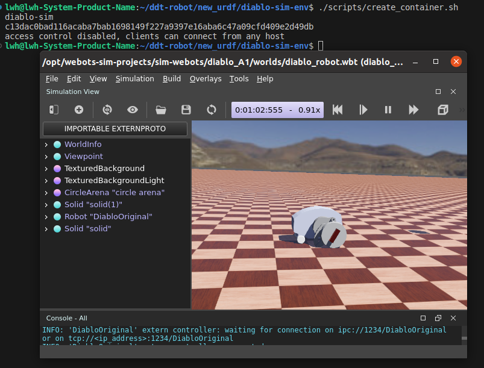

- [执行该脚本将从终端进入容器](scripts/enter_container.sh)
```bash
./scripts/enter_container.sh
```
- [执行该脚本将终止当前运行的容器](scripts/halt.sh)（即`diablo-sim`）
```bash
./scripts/halt.sh
```


## 如何自行打开Webots并开启仿真 

### 在容器内的终端执行以下命令启动webots
```shell
webots
```

## 1.初始化配置（如果使用的是提供的镜像可以跳到[第3步](#3打开仿真工程)）

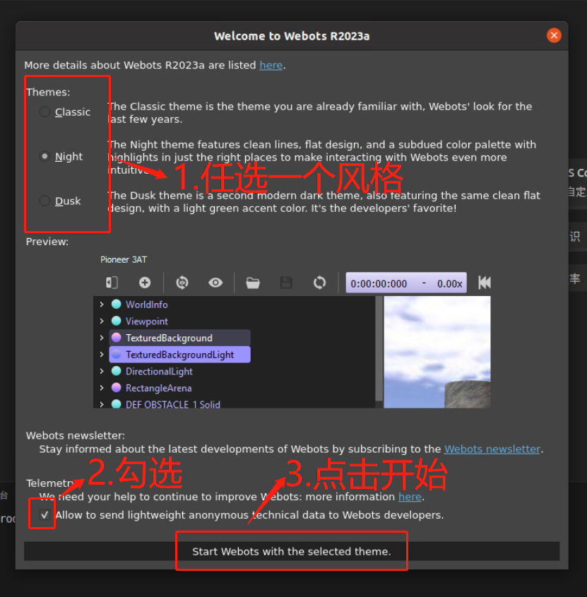

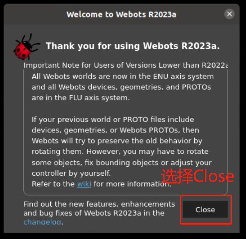

## 2.开始新手教程体验（熟悉webots的使用者可直接跳到[第3步](#3打开仿真工程)）

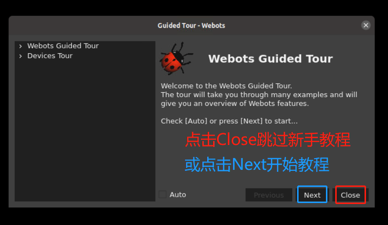

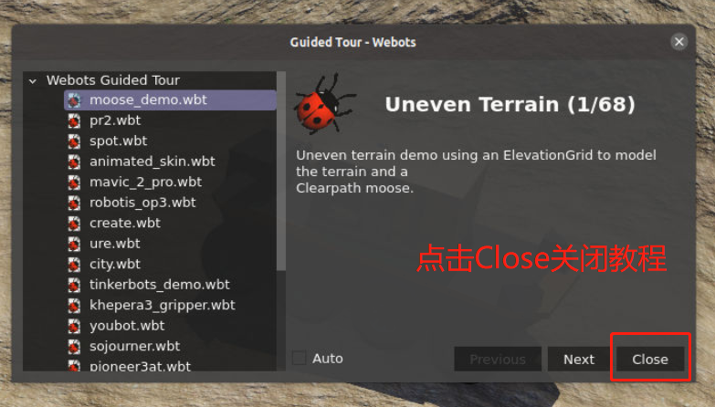

## 3.打开仿真工程

### 3.1 Step1:GUI操作加载webots模型

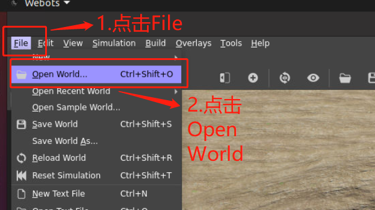

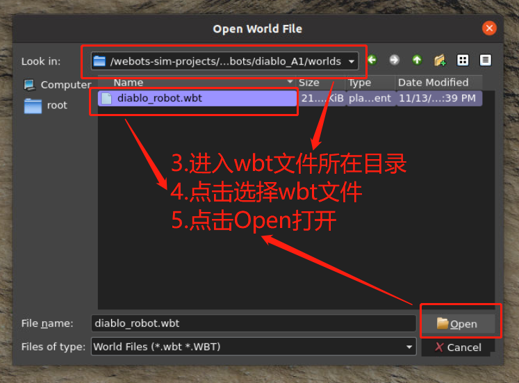


​									出现以下界面就表明成功打开了diablo-A1的webots模型

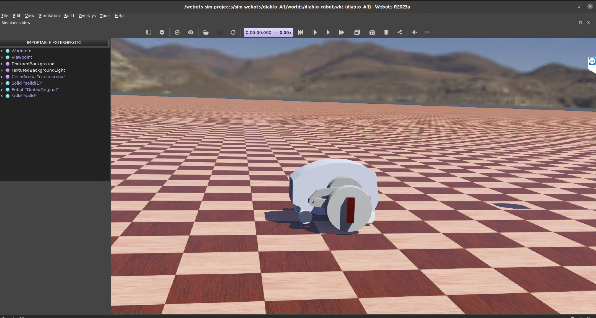

### 3.2 Step2:开启仿真
3.2.1在容器内的终端执行以下命令进入webots仿真工程内的makefile所在的目录
```shell
cd /opt/webots-sim-projects/sim-webots/diablo_A1/controllers/diablo_webots/
```
3.2.2进入makefile所在的目录后，执行`make`或`make debug`命令进行编译
```shell
make debug
```
3.2.3在编译完成后执行以下命令开启仿真
```shell
./diablo_webots
```
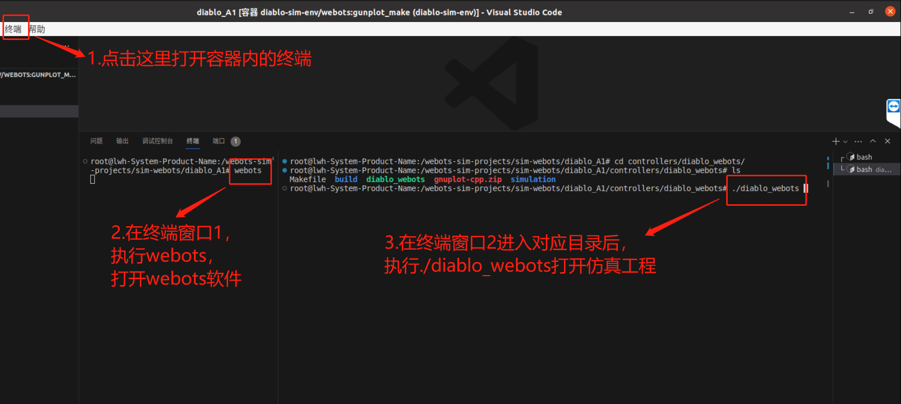

## Docker使用建议

### 推荐使用 Visual Studio Code + Dev Container插件进行调试 (也可直接使用终端)
安装用于远程开发 docker 容器的扩展 (ms-vscode-remote.remote-containers)： 

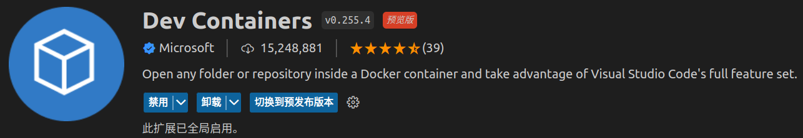

1.点击左下角的远程开发按钮，然后选择“Attach to Running Container”：

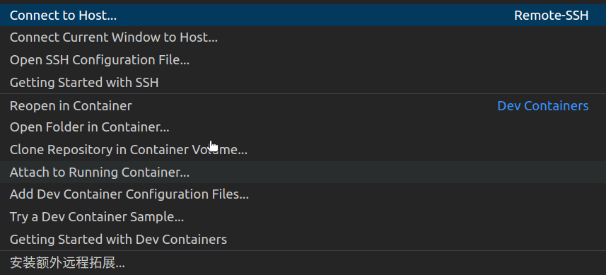

2.选择正在运行的Webots容器 `diablo-sim `，然后打开文件夹 `/opt/webots-sim-projects/sim-webots/diablo_A1`。  现在您应该能够直接对 docker 内的文件进行更改。 

- 请注意，以这种方式所做的任何更改 **都不会** 保留。   一旦容器被停止并删除，更改就会丢失。 建议仅使用 shell 进行调试并使用 `docker build`以进行持久更改。另外也可以使用 `docker commit `保存当前正在运行的容器。

- 默认情况下，仿真代码位于 `diablo_A1/` ( `diablo_A1/`在此仓库中）。  构建镜像时， `diablo_A1/`下面的所有代码将被复制到新镜像 `/opt/diablo-sim-projects`中。  
- 镜像的ENTRYPOINT为此存储库根目录中的[`start.sh`](start.sh)。生成映像时，此脚本将复制到 `/opt/start.sh` 并用作镜像的ENTRYPOINT。您可以任意更改此文件的内容以满足要求，如果不是重新构建镜像而是使用`docker commit`保存修改则不要更改脚本 `start.sh` 的名称。

[Dockerfile](Dockerfile)包含在此存储库中。要构建更新的客户端映像，请执行

```shell
# 使用名称“diablo-sim-env/webots”和标签“latest”构建 
docker build . --file Dockerfile --tag diablo-sim-env/webots:latest
```

### 如何将文件从本地环境（宿主机）复制到docker容器内 

```shell
## docker cp <本地路径/文件> <容器名称:容器内的路径>
docker cp /home/<user>/test.tar diablo-sim:/opt
```

## 其他：如何不使用Docker，直接在Ubuntu实机环境中安装Webots环境（不推荐）
[执行以下脚本将自动在实机中安装Webots,gdbgui和编译clone下来的diablo-A1工程](scripts/webots_install.sh)
```shell
./scripts/webots_install.sh
```