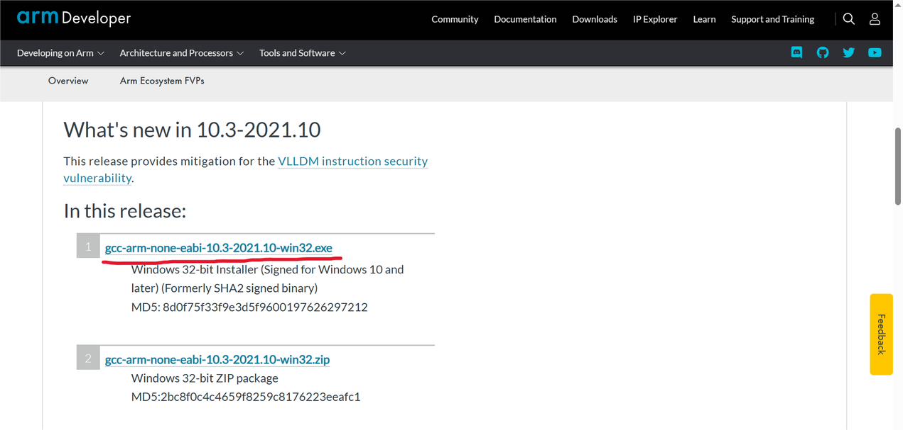
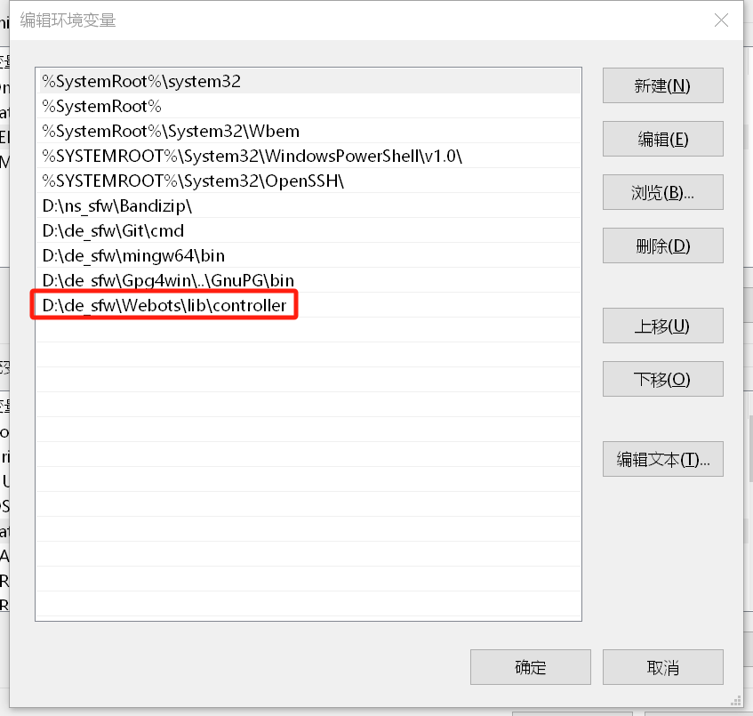

<p align="center"><strong>DIABIO-SIM-ENV</strong></p>
<p align="center"><a href="https://github.com/Direcrt-Drive-Technology/diablo-sdk-v1/blob/master/LICENSE"></a>


</p>


<p align="center">
    语言：<a href="README.en.md"><strong>English</strong></a> / <strong>中文</strong>
</p>


	基于Webots的机器人仿真环境。您可以通过仿真环境进行运动控制算法的仿真。

---
## Platform Support 支持平台

* Ubuntu 20.04/22.04 (64-bit PC (AMD64) desktop)
* Windows 10

## Dependencies 环境依赖

- [Docker](https://docs.docker.com/engine/install/ubuntu/) (if you use docker to install, this is necessary)

## Use without Docker
[Use this script to install Webots,gdbgui,and clonthe diablo-A1 project without controller](scripts/webots_install.sh)

Run the following in the bash : 

```shell
./scripts/webots_install.sh
```

---

## Use Docker

1. [Install nvidia driver](scripts/docker_install.sh)

```bash
./scripts/docker_install.sh
```
2. Imort the docker image (recommended by rmecboy)
 ```bash
docker pull heisonberg/diablo-sim-env:auto_start
 ```

3. Use docker container（run the script in your local host）

- [This script will build the container `diablo-sim`，open webots ,load .wbt and startsimulation](scripts/create_container.sh)
```bash
./scripts/create_container.sh
```
You shall see this if everything is normal.


- [Entr the docker container](scripts/enter_container.sh)
```bash
./scripts/enter_container.sh
```
- [Exit the docker container](scripts/halt.sh)（即`diablo-sim`）
```bash
./scripts/halt.sh
```


## Run webots with docker

### use the following command to run webots
```shell
webots
```


### Step1:Load the webots model


​								


### Step2:Run the simulation
2.2.1 Enter the makefile directory :  
```shell
cd /opt/webots-sim-projects/sim-webots/diablo_A1/controllers/diablo_webots/
```
2.2.2 compile the code
```shell
make debug
```
2.2.3 Run the simulation, you shall see the robot fall down. Now you can start to design your own controller.
```shell
./diablo_webots
```


## Windows Configuration
### 1.Install gcc-arm-none-eabi
- https://developer.arm.com/downloads/-/gnu-rm



- Remeber to choose Add path to envieonment variable


### 2.Install minGW
- https://sourceforge.net/projects/mingw-w64/files/Toolchains%20targetting%20Win64/Personal%20Builds/mingw-builds/8.1.0/


- unzip and open mingw64\bin，change mingw32-make.exe  to make.exe，then add the bin file to PATH.

### 3.Install Webots
- https://github.com/cyberbotics/webots/releases
，choose R2023a
- Add the following to PATH
Webots\lib\controller



### 4.Install the following in VSCODE


#### 4.1 modify launch.json
- Open VSCODE in diablo-sim-env\diablo_A1\controllers，then modify launch.json


将launch.json内容替换为如下代码
```
{
    "version": "0.2.0",
    "configurations": [
      {
        "type": "cppdbg",
        "request": "launch",
        "name": "Webots",
        "program": "${workspaceFolder}/diablo_webots/diablo_webots.exe",
        "stopAtEntry": false,
        "cwd": "${workspaceFolder}",
        "args": [ ],
        "environment": [],
        "externalConsole": false
      }
    ]
  }
```
#### 4.2 Modify Makefile
- Open diablo_webots\Makefile


Change WEBOTS_HOME_PATH to your webots path


- then ```make``` your project to generate diablo_webots.exe
```
cd /d/study/liao/diablo-sim-env/diablo_A1/controllers/diablo_webots

make debug
```
